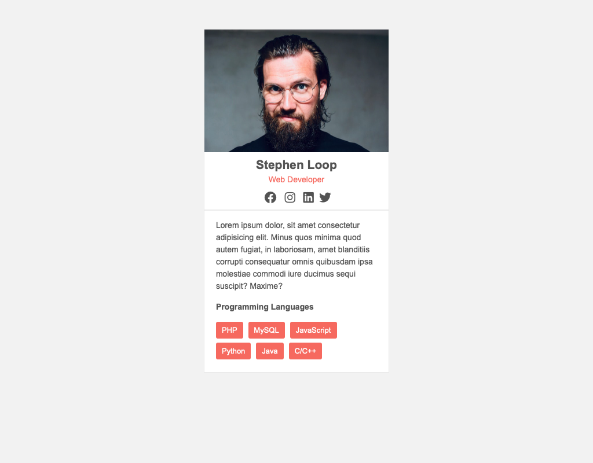

# Profile Card - CSS Project
In this assignment, you will develop the styles for a fictitous web developer profile component.

## Objetives
* Apply CSS styles to an HTML document.
* Target elements with different types of selectors.
* Practice basic text styling.
* Understand the box model.

## Instructions
Using the provided `index.html` file, modify `css/styles.css` to make the browser render the page as below.

Follow the step-by-step instructions below for guidance in completing this assignment. Write a selector for each step along with the specified styles. You should *only modify the CSS file* and not the included HTML. 

1. Set the font size on the html element to `14px`.

2. The default list styling places bullets next to each item. Target all the list items on the page and remove the bullets ... the property/value for the rule should be `list-style-type: none`.
   
3. Set the font stack for our page to `Arial, Helvetica, sans-serif` and make the text the following color `#666`. Note this is only a slight change from the default but makes it a little easier to read (not as much contrast). Also, the background color for the page should be keyword value `whitesmoke`. Set up the line height to be `1.5` for the entire page.
   
4. Targeting the article element with a class of `card`, set the following properties ...
   * Set the width to `320px`. Don't worry, the profile image will not resize to these dimensions yet.
   * Set top/bottom margin to `50px`.
   * Set the left/right margin to `auto`. This will center the card.
   * Set the background color to keyword color `white`.
   * Set a `1px` solid border on all sides of the card. It border color should be `#eee`.

5. Targeting the card header element, center all the text in here and place a solid bottom border with `2px` thickness and color `#eee`.

6. Fix the image by writing a selector/rule to set its width to `100%`. This will size it to fill 100% of the card we included it in.

7. Change the color of Stephen's title `Web Developer` to keyword color `salmon`.

8. Target the `nav` element with class `social` and add `5px` padding on all sides.

9. Change the list items of the social nav to display `inline` rather than the default `box` so they display side to side. Set the right margin to `5px` to give some space in between.

10. Remove the margin from the last list item of the social nav.

11. Change the text color of each link within the social nav to `#666` and make the font size `1.5rem`. This is 1.5 times the font size we set on the `html` element.

12. Add padding to the content area of the card (has class `content`). Use `15px` for top/bottom and `20px` for left/right.

13. Add `15px` top/bottom margin to the `h3` element in the content area.

14. Targeting the list item elememnts within the list with a class of `tags`, do the following ...
    * Change the display to `inline-block`.
    * Add a right margin of `5px` and a bottom margin of `7px` to each item.
    * Reduce the font size to `.9rem`.
    * Change the background to `salmon`.
    * Change the text color to `white`.
    * Add top/bottom badding of `5px` and left/right padding of `10px`.
    * Add some border radius ... `border-radius: 3px`. This will round out the corners of our tags.

15. Remove the right margin from the last list item in the tags nav.

## Submission
Submit your assignment by pushing to GitHub and submitting your repository URL in Blackboard.
